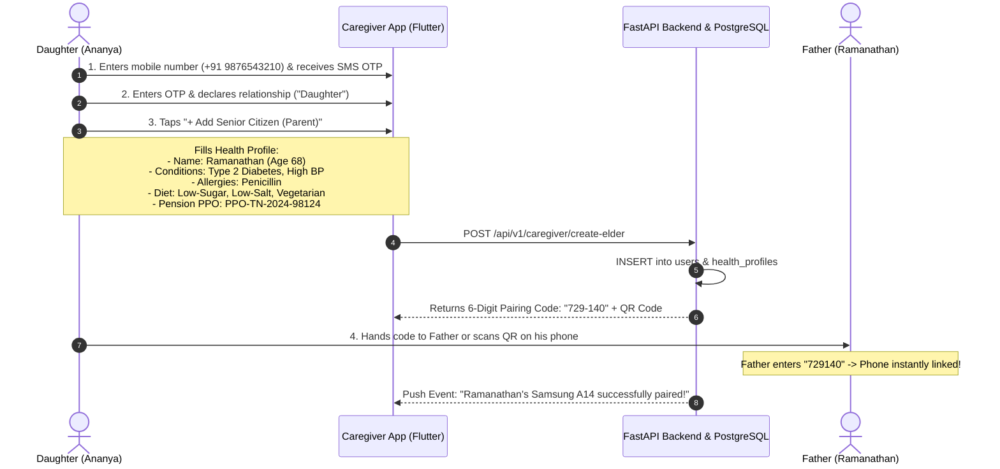
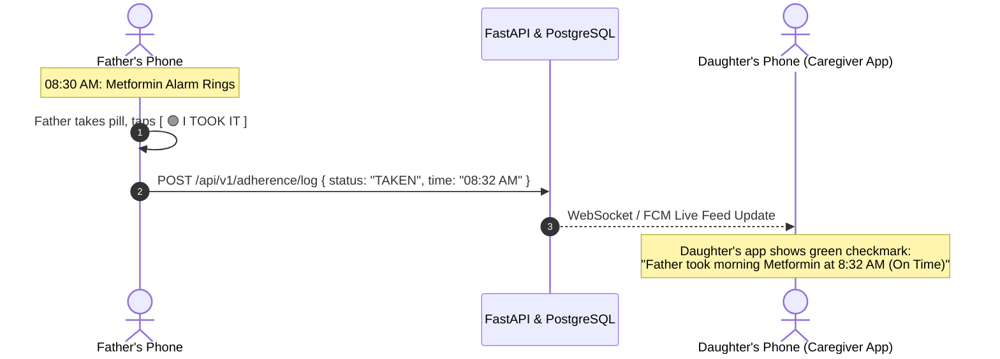
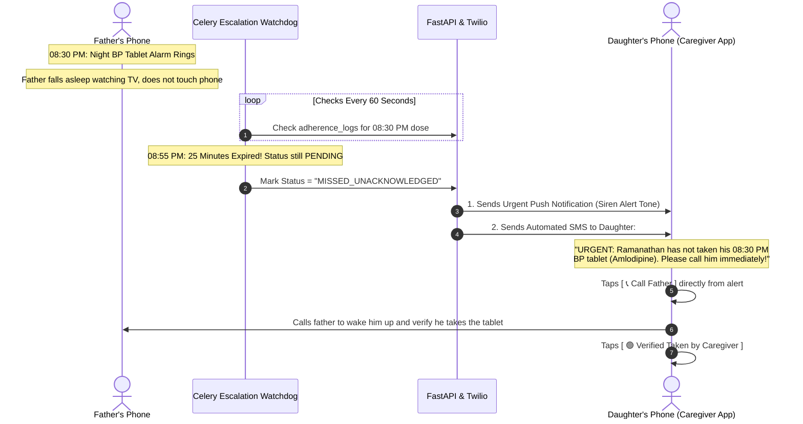
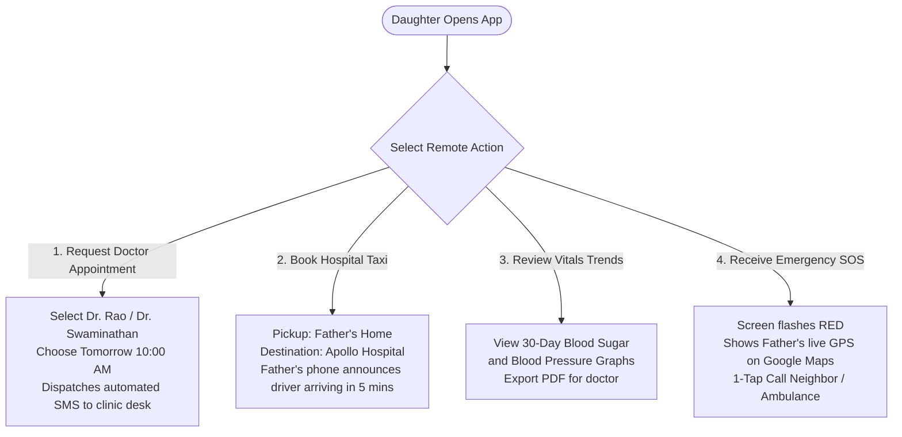

# Caregiver / Family Member Complete Working Flow Architecture & Actions (Updated 3-User Model)

This document provides the **complete, exhaustive working flow architecture, user actions, screen interactions, and technical processes** for the **Caregiver / Family Member (Son / Daughter / Nurse)** user in the **3-User Model** (**Senior Citizen**, **Caregiver**, and **Admin**).

In this 3-user architecture:

- The Caregiver acts as the **operational guardian of the elder's healthcare**.
- The Caregiver manages **Personal Family Doctors** and **Trusted Local Drivers** alongside the Admin's city directory, with no need for separate doctor/driver apps.
- The Caregiver receives **real-time adherence updates** and acts as the **first responder** during missed pill escalations and emergency SOS alerts.

---

## 1. Architectural & UX Principles for the Caregiver ("Guardian Mode")

```
┌────────────────────────────────────────────────────────────────────────┐
│ CAREGIVER UI/UX ARCHITECTURAL PRINCIPLES                               │
│ • Remote Peace of Mind: Verify parent's meals, pills, and vitals at a  │
│   single glance from work or another city.                             │
│ • Zero-Effort Parent Provisioning: Caregiver does all complex form     │
│   entries so the elderly parent never has to type medical data.        │
│ • Doctor & Driver Directory Management: Caregiver can add personal     │
│   family doctors and trusted auto/cab drivers directly for the elder.  │
│ • Real-Time Live Feed: Instant green checkmarks when pills are taken.  │
│ • 25-Minute Fail-Safe Watchdog: Automatic push alarms and urgent SMS   │
│   if parent misses critical medications.                               │
│ • Multi-Elder Support: Toggle seamlessly between Mother and Father.    │
└────────────────────────────────────────────────────────────────────────┘
```

---

## 2. Master Caregiver Working Flow Architecture (3-User Context)

```mermaid
flowchart TD
    subgraph Caregiver_Client ["Caregiver Mobile App (Flutter / Web)"]
        C_Start([1. Sign Up / Login]) --> C_Auth[2. Phone + OTP Auth]
        C_Auth --> C_ElderSetup[3. Senior Health Provisioning\nChronic Diseases, Allergies, Diet]
        C_ElderSetup --> C_PairCode[4. Generate 6-Digit Pair Code & QR\nSync with Father's Phone]

        C_PairCode --> C_Dashboard([5. Active Guardian Dashboard])

        %% Core Operational Modules
        C_Dashboard --> C_Meds[A. Medication & Alarm Configurator\nDosages, Times, Pill Photos, Escalation]
        C_Dashboard --> C_Diet[B. Diet & Hydration Scheduler\nMeal times, Sugar/Salt rules, Water target]
        C_Dashboard --> C_Workout[C. Senior Workout Assignment\nAssign 15-min Chair Yoga & Mobility]
        C_Dashboard --> C_SOS[D. Emergency Safety Network Config\nPrimary Family, Neighbor, Ambulance]
        C_Dashboard --> C_Directory[E. Personal Doctor & Driver Manager\nAdd trusted clinic doctors & local cabs]

        %% Real-time monitoring & remote care
        C_Dashboard --> C_LiveMonitor[F. Real-Time Adherence Timeline\nInstant green checkmarks when pills taken]
        C_Dashboard --> C_Escalation[G. 25-Min Missed Pill Watchdog\nReceives urgent SMS/Call if pill missed]
        C_Dashboard --> C_RemoteOps[H. Remote Care Operations\nRequest Doctor Visit, Book Cab, Track Vitals]
    end

    subgraph Backend_Cloud ["FastAPI Backend & Cloud Services"]
        C_ElderSetup --> DB_User[(PostgreSQL: Users & Profiles)]
        C_Meds --> DB_Meds[(PostgreSQL: Medications Table)]
        C_Directory --> DB_Dir[(PostgreSQL: Doctor & Taxi Tables)]
        C_LiveMonitor <==>|WebSocket / FCM| S_Feed[FastAPI Adherence Service]
        C_Escalation <==|Urgent SMS & Push| Celery_Esc[Celery Escalation Watchdog]
    end
```

---

## 3. Phase 1: Onboarding, Authentication & Elder Profile Provisioning



---

## 4. Phase 2: Medication & Alarm Configuration (The Medicine Form)

### Action 2.1: Adding a Scheduled Medicine

- **Caregiver Action:** Opens **"Medications" Tab** $\rightarrow$ Taps floating **`[ + Add Medicine ]`** button.
- **Form Inputs:**
  - **Medicine Name:** _Metformin_
  - **Dosage Type:** _Tablet_ | **Strength:** _500 mg_
  - **Meal Relation:** _After Food (Breakfast)_
  - **Alarm Times:** `[✓] 08:30 AM` and `[✓] 08:30 PM`
  - **Recurrence:** _Daily (Mon - Sun)_
  - **Pill Photo Upload:** Daughter takes a clear photo of the white oval Metformin tablet using her phone camera.
  - **Alarm Sound:** _Loud Spoken Chime (90% Volume)_.
  - **Safety Escalation Rule:** `[✓] Alert Caregiver if unacknowledged after 25 minutes`.
- **System Process:**
  1. `POST /api/v1/medications` inserts record into PostgreSQL.
  2. Celery Beat periodic scheduler registers background cron triggers for `08:30:00` and `20:30:00`.
  3. Silent FCM packet is pushed to Father's phone to cache the pill photo and program the phone's native `AlarmManager`.
  4. Caregiver sees confirmation: _"Metformin 500mg armed on Father's phone for 08:30 AM & 08:30 PM"_.

```
┌────────────────────────────────────────────────────────┐
│ < Back           Add Medicine & Alarm                  │
├────────────────────────────────────────────────────────┤
│ Medicine Name *: [ Metformin                         ] │
│ Dosage Type *:   (•) Tablet  ( ) Capsule  ( ) Syrup    │
│ Strength *:      [ 500 mg                            ] │
│ Meal Relation *: [ After Food                      ▼ ] │
│                                                        │
│ Scheduled Times *:                                     │
│ [✓] Morning Dose: [ 08:30 AM ⏰ ]                      │
│ [✓] Night Dose:   [ 08:30 PM ⏰ ]                      │
│                                                        │
│ Pill Photo *: [ 📷 Photo of White Oval Tablet Taken  ] │
│ Alarm Sound:  [ Loud Spoken Chime (90% Volume)     ▼ ] │
│ Escalation:   [ Alert Caregiver after 25 Mins      ▼ ] │
│                                                        │
│        [ SAVE & ARM ALARM ON FATHER'S PHONE ]          │
└────────────────────────────────────────────────────────┘
```

---

## 5. Phase 3: Diet Plan & Hydration Timetable Configuration

### Action 3.1: Customizing Daily Nutrition & Meals

- **Caregiver Action:** Opens **"Diet & Nutrition" Tab** $\rightarrow$ **`[ Customize Meal Timings ]`**.
- **Customization:**
  - **07:00 AM:** Warm water reminder (250 ml).
  - **08:00 AM (Breakfast):** Recommends Steamed Idli (2) or Oats; strictly excludes white sugar and deep-fried vadas.
  - **11:00 AM:** Fruit snack & water reminder.
  - **01:00 PM (Lunch):** Steamed greens, dal, brown rice; low-salt directive for high BP.
  - **07:30 PM (Dinner):** Light vegetable soup, 2 wheat rotis.
  - **Hydration Goal:** 2.0 Liters (8 glasses), repeat water chime every 2 hours.
- **System Process:** Submits to `POST /api/v1/diet/plan`, scheduling automated daily push prompts to Father's phone.

---

## 6. Phase 4: Senior Workout & Physical Activity Assignment

### Action 4.1: Assigning Guided Exercises

- **Caregiver Action:** Opens **"Fitness & Exercise" Tab**.
- **Browses Doctor-Approved Workout Library:**
  - _15-Minute Chair Yoga & Joint Mobility (for Arthritis & BP)_.
  - _10-Minute Deep Diaphragmatic Breathing (for Cardiac Health)_.
  - _12-Minute Seated Ankle & Knee Rotations (for Blood Circulation)_.
- **Assignment:** Taps **`[ Assign to Father ]`**, sets time to `05:00 PM Daily`.
- **System Process:** At 05:00 PM, the Father's phone receives an audible prompt: _"Time for your 15-minute chair yoga!"_ and displays the video player.

---

## 7. Phase 5: Personal Doctor & Driver Directory Management (3-User Model)

In the 3-user model, the Caregiver can manage trusted neighborhood doctors and drivers directly for the elder:

### Action 5.1: Adding a Personal Family Doctor

- **Caregiver Action:** Opens **"Doctors" Tab** $\rightarrow$ **`[ + Add Personal Family Doctor ]`**.
- **Inputs:**
  - Doctor Name: _Dr. K. Swaminathan (Family Doctor for 15 Years)_.
  - Specialty: _General Physician / Diabetologist_.
  - Phone Number: `+91 9876543225`.
  - Clinic Address: _Flat 10, 2nd Cross, Anna Nagar_.
- **Outcome:** Dr. Swaminathan instantly appears on the Father's phone with a large photo and **[ 📞 Call Doctor Now ]** button.

### Action 5.2: Adding a Trusted Local Driver / Cab Desk

- **Caregiver Action:** Opens **"Transport & Taxis" Tab** $\rightarrow$ **`[ + Add Trusted Driver ]`**.
- **Inputs:**
  - Driver / Service Name: _Murugan Auto (Next-Door Stand)_.
  - Vehicle Type: _Auto Rickshaw / Sedan_.
  - Phone Number: `+91 9876543235`.
- **Outcome:** Murugan Auto appears as the primary 1-tap call option on the Father's taxi screen.

---

## 8. Phase 6: Emergency Safety Network Configuration (SOS Setup)

### Action 6.1: Defining the Escalation Contact Chain

- **Caregiver Action:** Opens **"Safety & SOS" Tab** $\rightarrow$ **`[ Edit Emergency Contacts ]`**.
- **Sets up the 3-tier Priority Chain:**
  1. **Priority 1 (Daughter - Primary Family):**
     - Phone: `+91 9876543210` $\rightarrow$ Receives instant SOS SMS with live Google Maps link, push alarm, and missed pill alerts.
  2. **Priority 2 (Mr. Sharma - Next-Door Neighbor):**
     - Phone: `+91 9876543211` $\rightarrow$ Receives emergency SMS during SOS.  
       _(In a fall or heart emergency, the neighbor can reach the house in **30 seconds**, while the daughter may be 45 minutes away in traffic!)_
  3. **Priority 3 (Hospital & Ambulance):**
     - Apollo City Hospital & 108 Ambulance $\rightarrow$ Auto-dialed directly from the elder's phone during an SOS.

---

## 9. Phase 7: Live Daily Monitoring & The 25-Minute Escalation Loop

### 9.1 When Father Takes Medicine On Time (Normal Flow):



---

### 9.2 When Father Misses Medicine (The 25-Minute Escalation Watchdog):



---

## 10. Phase 8: Remote Care Operations (On-Demand)



- **Remote Doctor Scheduling:** Daughter selects _Dr. Rao_, chooses _Tomorrow 10:00 AM_. The backend sends an automated SMS to the clinic reception:  
  `"APPOINTMENT REQUEST: Patient Ramanathan (Age 68) for Tomorrow 10:00 AM. Please call +91 9876543210 to confirm."`
- **Remote Taxi Booking:** Daughter books a cab to take her father to the hospital. The father's phone speaks aloud: _"Ananya has booked you a taxi. Driver Ramesh arrives in 5 minutes."_
- **Reviewing Health Trends:** Daughter views interactive 30-day graphs of Blood Sugar and Blood Pressure.

---

## 11. Complete Caregiver Dashboard Screen (3-User Model)

```
┌────────────────────────────────────────────────────────┐
│ 🧑 Caregiver Dashboard                 [ 🔔 Alerts (1) ]│
│ Active Senior: 👴 Ramanathan (Father)                  │
├────────────────────────────────────────────────────────┤
│ 🟢 TODAY'S ADHERENCE SCORE: 100% (All Pills on Time)   │
│                                                        │
│ 📋 TODAY'S LIVE TIMELINE:                              │
│ • 07:00 AM: Warm Water (250ml)  ─── [ ✅ Acknowledged ]│
│ • 08:00 AM: Breakfast (Oats)    ─── [ ✅ Acknowledged ]│
│ • 08:30 AM: Metformin 500mg     ─── [ ✅ Taken 8:32 AM ]│
│ • 01:00 PM: Lunch (Low Salt)    ─── [ ✅ Acknowledged ]│
│ • 05:00 PM: 15-Min Chair Yoga   ─── [ ✅ Completed     ]│
│ • 07:30 PM: Dinner              ─── [ ⏳ Next in 1 hr  ]│
│ • 08:30 PM: Amlodipine 5mg      ─── [ ⏰ Scheduled     ]│
│                                                        │
│ 📊 HEALTH VITALS (LAST 30 DAYS):                       │
│ • Fasting Blood Sugar: 124 mg/dL [ 🟢 Normal ]         │
│ • Blood Pressure:      130/84 mmHg [ 🟢 Controlled ]   │
│ [ View Detailed Trend Graphs & Export PDF ]            │
│                                                        │
│ ⚡ QUICK REMOTE ACTIONS:                                │
│ ┌────────────────────────┐  ┌────────────────────────┐ │
│ │ 💊 + ADD MEDICINE      │  │ 👨‍⚕️ REQUEST DOCTOR     │ │
│ └────────────────────────┘  └────────────────────────┘ │
│ ┌────────────────────────┐  ┌────────────────────────┐ │
│ │ 🚖 BOOK HOSPITAL CAB   │  │ 🚨 EMERGENCY CONTACTS  │ │
│ └────────────────────────┘  └────────────────────────┘ │
│                                                        │
│ [ 📞 CALL FATHER DIRECTLY ]                            │
└────────────────────────────────────────────────────────┘
```
