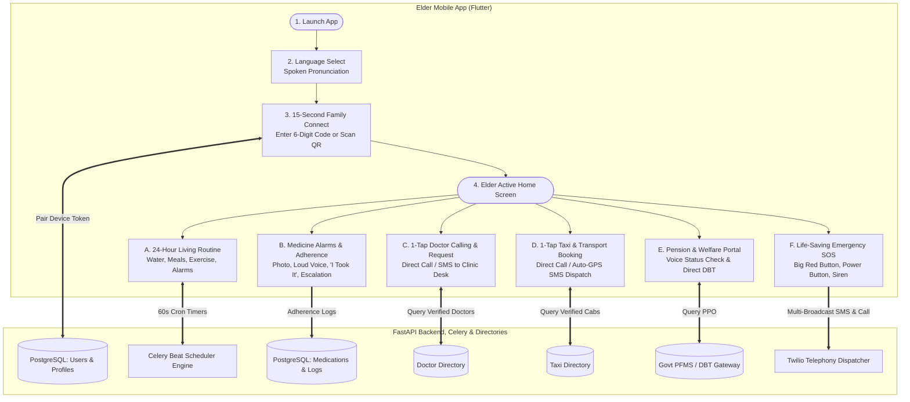
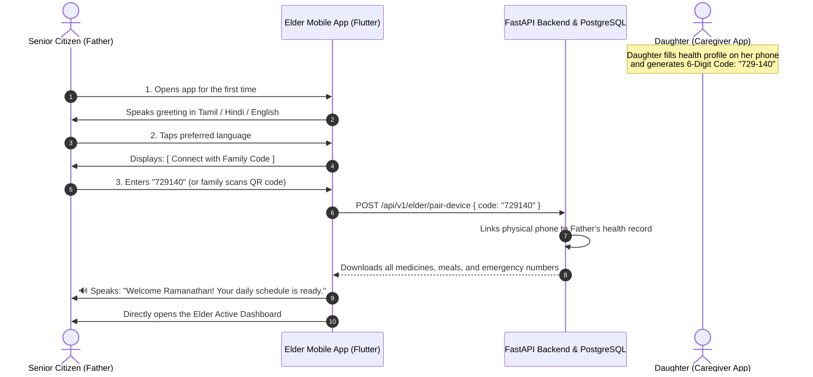
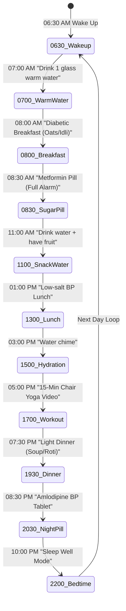
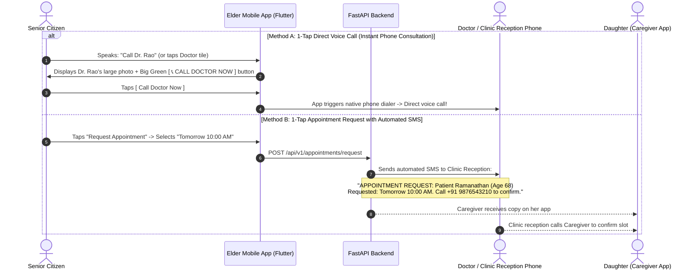

# Senior Citizen (Elder) Complete Working Flow Architecture & Actions (Updated 3-User Model)

This document provides the **complete, exhaustive working flow architecture, action-by-action lifecycle, screen interactions, and technical processes** for the **Senior Citizen (Elder)** user in the **3-User Model** (**Elder**, **Caregiver**, and **Admin**).

In this production model:
* **Senior Citizen** interacts via **Voice-First, High-Contrast Big Buttons, and Direct 1-Tap Telephony**.
* **Doctors and Taxis** are managed as verified service directories by Admin & Caregiver, allowing the Elder to call and schedule seamlessly without needing separate doctor/driver apps.

---

## 1. Architectural & Ergonomic Principles for Seniors

```
┌────────────────────────────────────────────────────────────────────────┐
│ ELDER UI/UX ARCHITECTURAL PRINCIPLES                                   │
│ • Minimum Typography Size: 24pt - 32pt (High-legibility sans-serif)   │
│ • Minimum Touch Target Size: 64 x 64 dp (No small icons or menus)      │
│ • High-Contrast Color Palette: Pure Black (#000000), White (#FFFFFF),   │
│   Emergency Red (#D32F2F), Confirm Green (#2E7D32), Alert Amber (#F57F17)│
│ • Audio Feedback: Every button speaks its title aloud when pressed.    │
│ • Touch Tremor Debounce: 400ms delay to prevent accidental double-taps.│
│ • Zero Deep Navigation: All core features live on the Single Dashboard.│
│ • Offline Resilience: Alarms ring locally even if internet is down.    │
└────────────────────────────────────────────────────────────────────────┘
```

---

## 2. Master Elder Working Flow Architecture (3-User Context)



---

## 3. Phase 1: Installation, Language Selection & 15-Second Pairing Flow



---

## 4. Phase 2: The 24-Hour Daily Living Loop (Action-by-Action)



### Detailed Daily Actions:

1. **07:00 AM — Morning Warm Water Hydration:**
   * **System Action:** Plays temple bell chime + voice: *"Good morning Ramanathan! Please drink 1 glass of warm water."*
   * **Elder Action:** Drinks water, taps big button **`[ 🟢 Drank 1 Glass ]`** $\rightarrow$ Water counter shows **1/8 Glasses (250ml / 2000ml)**.
2. **08:00 AM — Breakfast Alert (Diabetic Management):**
   * **System Action:** Chime + Food card: *"Time for breakfast. Recommended: Steamed idli or oats porridge. Avoid white sugar."*
   * **Elder Action:** Eats, taps **`[ 🟢 I Ate My Breakfast ]`**.
3. **08:30 AM — Morning Medicine Alarm (The Critical Adherence Flow):**
   * **System Action:** Phone triggers a **Full-Screen Alarm Overlay** (wakes up phone even if screen is locked), vibrates continuously, sounds a loud chime, and displays a **real photograph of the Metformin pill**.
   * **Spoken Voice:** *"Ramanathan, please take your Metformin Sugar pill after food."*

```
┌────────────────────────────────────────────────────────┐
│ ⏰ 08:30 AM                       MEDICINE ALARM       │
├────────────────────────────────────────────────────────┤
│                   [ PHOTO OF METFORMIN ]               │
│                    (White Oval Tablet)                 │
│                                                        │
│                  METFORMIN - 500 MG                    │
│                 1 Tablet (After Food)                  │
│                                                        │
│      🔊 Voice: "Please take your Sugar tablet"         │
│                                                        │
│ ┌────────────────────────────────────────────────────┐ │
│ │             🟢  I TOOK IT (CONFIRM)                │ │
│ └────────────────────────────────────────────────────┘ │
│ ┌────────────────────────────────────────────────────┐ │
│ │             🟡  SNOOZE (10 MINUTES)                │ │
│ └────────────────────────────────────────────────────┘ │
│ ⚠️ If not acknowledged, daughter Ananya will be        │
│    notified in 25 minutes for safety.                  │
└────────────────────────────────────────────────────────┘
```

* **Action Option A (Taps `[ 🟢 I TOOK IT ]`):** Alarm stops, logged as `TAKEN`, daughter’s phone gets an instant green checkmark.
* **Action Option B (Taps `[ 🟡 SNOOZE ]`):** Alarm snoozes, rings again in 10 minutes.
* **Action Option C (Elder forgets / sleeps for 25 minutes):** Backend **Escalation Watchdog** triggers, sending an urgent SMS/call to daughter Ananya: *"ALERT: Father has not taken his 08:30 AM Sugar pill! Please call him."*

4. **01:00 PM — Lunch Alert (BP Management):**
   * Voice prompt: *"Time for lunch. Please remember to keep salt low for your blood pressure."*
   * Elder eats, taps **`[ 🟢 I Ate Lunch ]`**.
5. **05:00 PM — Guided Senior Workout & Exercise Action:**
   * **System:** Chime sounds: *"Time for your 15-minute gentle chair exercise!"*
   * **Elder Action:** Taps the big tile **`[ ▶️ START 15-MIN CHAIR YOGA ]`** on the home screen.
   * **In-App Video Player Launches:**
     * Plays **15-Minute Chair Yoga & Joint Mobility Video** uploaded by physiotherapists/admin.
     * Audio guidance plays at a calming **$0.85\times$ slower speed** with presbycusis-tuned frequency.
     * Elder sits on a chair and follows the seated movements (Breathing $\rightarrow$ Ankle rotations $\rightarrow$ Shoulder rolls $\rightarrow$ Knee stretches).
   * **Elder Action:** Taps **`[ 🟢 Completed Exercise ]`** $\rightarrow$ Phone speaks: *"Great job Ramanathan! Exercise completed."*
6. **08:30 PM — Night Medicine Alarm:** Full-screen alarm pops up with photo of **Amlodipine (BP tablet)** $\rightarrow$ Taps **`[ 🟢 I TOOK IT ]`**.
7. **10:00 PM — Bedtime & Sleep Well Mode:** Screen turns dark, voice says *"Goodnight Ramanathan"*, mutes non-emergency sounds.

---

## 5. Phase 3: 3-User Integrated Doctor Consultation & Calling Flow

In the 3-user model, doctors are verified directory contacts. The elder does not need to learn a complex video calling portal:



### Elder Screen: Doctor Contact Card
```
┌────────────────────────────────────────────────────────┐
│ < Back             Doctor Consultation                 │
├────────────────────────────────────────────────────────┤
│                  [ PHOTO: DR. V. RAO ]                 │
│              Senior Cardiologist - Apollo              │
│                 Phone: +91 9876543220                  │
│             Hours: 10:00 AM - 01:00 PM                 │
├────────────────────────────────────────────────────────┤
│ ┌────────────────────────────────────────────────────┐ │
│ │                                                    │ │
│ │        🟢  [ 📞 CALL DR. RAO DIRECTLY ]            │ │
│ │                                                    │ │
│ └────────────────────────────────────────────────────┘ │
│                                                        │
│ ┌────────────────────────────────────────────────────┐ │
│ │    🟡  [ 📅 REQUEST APPOINTMENT FOR TOMORROW ]     │ │
│ └────────────────────────────────────────────────────┘ │
│                                                        │
│ 🔊 Spoken Voice: "Tap green button to call doctor      │
│    or tap yellow to request tomorrow's appointment."   │
└────────────────────────────────────────────────────────┘
```

---

## 6. Phase 4: 3-User Integrated Hospital Taxi & Transport Flow

```mermaid
flowchart TD
    ElderStart([Elder speaks: 'Book taxi to Apollo Hospital'\nor taps 'Book Taxi']) --> Choice{Booking Mode}

    Choice -->|Method 1: Direct 1-Tap Call| DirectCall[App shows Driver Photo + Big Button\n[ 📞 CALL DRIVER NOW ]\nDirect phone call to book cab]

    Choice -->|Method 2: Automated GPS SMS Dispatch| SMSDispatch[App captures Current GPS Coordinates\nBackend sends automated SMS to Driver:\n'Pickup request for Senior Ramanathan at [Google Maps Link]\nHeading to Apollo Hospital. Please call back immediately!']

    Choice -->|Method 3: Caregiver Books Remotely| CGRemote[Caregiver books cab from her office\nFather's phone announces aloud:\n'Daughter Ananya booked you a cab arriving in 5 mins']
```

### Elder Screen: Taxi Booking Card
```
┌────────────────────────────────────────────────────────┐
│ < Back               Book Hospital Taxi                │
├────────────────────────────────────────────────────────┤
│ 📍 Pickup: [ Auto-GPS: 42 Anna Nagar, Chennai        ] │
│ 🏥 Destination: [ (•) Apollo Hospital   ( ) Clinic   ] │
├────────────────────────────────────────────────────────┤
│             [ 🚖 DRIVER: RAMESH (WHITE SWIFT) ]        │
│                   Phone: +91 9876543230                │
│                                                        │
│ ┌────────────────────────────────────────────────────┐ │
│ │          🟢  [ 📞 CALL DRIVER DIRECTLY ]           │ │
│ └────────────────────────────────────────────────────┘ │
│ ┌────────────────────────────────────────────────────┐ │
│ │      🟡  [ 📨 SEND AUTOMATIC GPS PICKUP SMS ]      │ │
│ └────────────────────────────────────────────────────┘ │
│                                                        │
│ 🔊 Spoken Voice: "Tap green button to call the driver  │
│    or tap yellow to send your location automatically." │
└────────────────────────────────────────────────────────┘
```

---

## 7. Phase 5: Pension & Government Welfare Services Flow

* **Voice Query:** Elder taps mic: *"Did my pension come this month?"*
* **System Processing:**
  1. DSP cleans audio $\rightarrow$ Whisper transcribes text $\rightarrow$ Gemini extracts `check_pension_status`.
  2. Queries Government Direct Benefit Transfer (DBT) gateway using linked PPO number.
  3. **Voice Output:** *"Yes Ramanathan, your pension of ₹2,500 was credited to your State Bank of India account on September 1st."*
  4. **Screen Display:** Large green badge:  
     `✅ PENSION CREDITED | ₹2,500 | Date: 01-Sept-2026 | SBI Account`.

---

## 8. Phase 6: Life-Saving Emergency SOS Flow (Triple-Trigger)

```mermaid
flowchart TD
    SOS_Trigger([Elder Triggers Emergency:\n1. Taps Big Red SOS Button\n2. Shouts 'Help Emergency'\n3. Triple-Presses Phone Power Button]) --> Siren[Phone sounds 100% volume siren locally]
    
    Siren --> GPS[Captures High-Precision GPS Coordinates]
    GPS --> Dispatch[FastAPI Emergency Dispatcher]

    Dispatch --> Contact1[1. Urgent SMS + Push to Daughter:\n'EMERGENCY: Father pressed SOS at [Google Maps Live Link]']
    Dispatch --> Contact2[2. Urgent SMS to Next-Door Neighbor (Mr. Sharma):\n'Neighbor Alert: Mr. Ramanathan next door needs urgent help!']
    Dispatch --> AutoDial[3. Phone automatically dials 112 / 108 Ambulance]
    Dispatch --> Screen[4. Phone screen displays nearby hospitals with 1-tap call buttons]
```

### The 3 Ways an Elder Can Trigger SOS:
1. **On Screen:** Tapping the **Big Red SOS Button** (always visible at top-right).
2. **By Voice:** Shouting *"Help! Emergency!"* into the phone.
3. **Physical Power Button:** Rapidly pressing the physical phone power button **3 times** (works even if screen is locked or dark).

---

## 9. Phase 7: Digital Signal Processing (DSP) Audio Engine

```
[ Elder Voice Input ] ──> [ INPUT DSP ENGINE ] ──> [ Whisper STT ] ──> [ Gemini AI ]
                                                                             │
[ Elder Ear Output  ] <── [ OUTPUT DSP ENGINE] <── [ Neural TTS  ] <─────────┘
```

1. **Input DSP (Senior Speech Enhancement):**
   * **Acoustic Echo Cancellation (AEC):** Cancels system audio feedback.
   * **High-Pass Filter (HPF):** 80Hz cutoff removes fan and AC hum.
   * **Automatic Gain Control (AGC):** Digitally amplifies weak, trembling voices to **$-16 \text{ LUFS}$**.
   * **Voice Activity Detection (VAD):** 1.5-second hangover buffer allows elders to pause to catch their breath without being cut off.
2. **Output DSP (Presbycusis Hearing Filter):**
   * **Presbycusis Peaking EQ:** Boosts **$1,500 \text{ Hz} - 4,000 \text{ Hz}$** frequencies by **$+6 \text{ dB}$** to sharpen consonant sounds (*p, t, k, s, ch*).
   * **WSOLA Time-Stretching:** Slows voice output to **$0.85\times$ speed without altering pitch**, giving elderly minds sufficient time to comprehend instructions.

---

## 10. The Complete Elder Home Dashboard Screen (3-User Model)

```
┌────────────────────────────────────────────────────────┐
│ 👴 Good Morning, Ramanathan!           [ 🚨 BIG RED SOS ]│
│ 📅 Tuesday, 08 September 2026                          │
├────────────────────────────────────────────────────────┤
│ ⏰ NEXT MEDICINE IN 30 MINS:                           │
│ ┌────────────────────────────────────────────────────┐ │
│ │ 💊 METFORMIN 500 MG (After Breakfast)              │ │
│ │    Time: 08:30 AM  |  1 Tablet                     │ │
│ └────────────────────────────────────────────────────┘ │
│                                                        │
│ 💧 HYDRATION TRACKER:                                  │
│ [ 💧 💧 💧 ⚪ ⚪ ⚪ ⚪ ⚪ ] (3 of 8 Glasses Drank)     │
│ [ + I DRANK 1 GLASS OF WATER ]                         │
│                                                        │
│ 🧘 TODAY'S EXERCISE (05:00 PM):                        │
│ [ ▶️ START 15-MIN CHAIR YOGA VIDEO ]                   │
│                                                        │
│ 4 GIANT SHORTCUT TILES:                                │
│ ┌────────────────────────┐  ┌────────────────────────┐ │
│ │ 👨‍⚕️ CALL DOCTOR        │  │ 🚖 CALL TAXI           │ │
│ └────────────────────────┘  └────────────────────────┘ │
│ ┌────────────────────────┐  ┌────────────────────────┐ │
│ │ 🏦 CHECK PENSION       │  │ 📞 CALL DAUGHTER       │ │
│ └────────────────────────┘  └────────────────────────┘ │
│                                                        │
│                                                        │
│                 [ 🎙️ TAP & SPEAK ]                     │
│                 (FLOATING VOICE MIC)                   │
└────────────────────────────────────────────────────────┘
```
